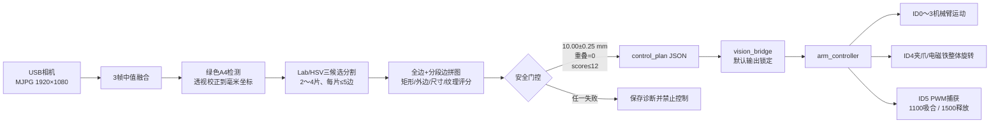

# E题拼图装置：视觉到电控整体链路

版本日期：2026-07-31  
适用工程：`km1_arm_ws`  
硬件：NVIDIA Orin NX、KM1机械臂、ID4改装旋转夹爪、电磁铁、ID5 PWM捕获电路

## 1. 系统结论

当前链路已经实现相机采图、A4纸定位、碎片分割、随机拼图、1 cm间距规划、
ROS控制计划、机械臂取放、ID4末端旋转和ID5电磁铁吸放。真实运动前仍需完成
纸面XY精度和接触Z标定。ID4±30°、ID5 1100/1500 μs控制信号及z=180～40 mm
分级非接触动作已经完成实测，但不等于真实吸放或自动拼图已验收。

当前实物台架使用横放A4：近侧长边中点与圆形底座前沿中点重合，物理右半区取料、
左半区拼装。视觉仍将纸面校正为210×297 mm坐标；右半区对应较小的`paper_y`，
左半区对应较大的`paper_y`。相机光心距纸面实测600 mm。

当前改装圆柱电磁铁半径20 mm、高20 mm；原夹爪`L3=155 mm`不再适用，腕轴到
吸附面的`L3`暂取80 mm，需与接触Z标定一起复核。

## 2. 数据与控制流



## 3. 视觉输入与相机安装

| 项目 | 建议 |
|---|---|
| 相机位置 | A4中心正上方，光轴垂直纸面 |
| 光心距纸面 | 实测600 mm，作为当前固定台架条件 |
| 输入格式 | MJPG 1920×1080@30，缓冲深度1 |
| A4画面尺度 | 短边建议≥500 px，四周保留定位余量 |
| 采图时机 | 机械臂停在纸外安全位后采3帧中值 |
| 曝光 | 固定曝光、增益和白平衡，使用均匀漫反射照明 |
| 深度信息 | 当前平面拼图不需要；翘曲、叠放或Z未知时才考虑RGB-D |

当前实拍中A4约占画面6.5%，短边约314 px，仍可通过低分辨率5 mm轮廓简化工作，
但误差余量偏小。相机高度已固定为600 mm，后续只能通过镜头视场、传感器分辨率和
安装位置优化真实采样密度；软件裁剪放大不能恢复未采集的边缘细节。

## 4. 视觉算法

| 阶段 | 关键处理 | 失败时行为 |
|---|---|---|
| A4检测 | HSV绿色候选、四边形和面积检查 | 不输出计划 |
| 纸面校正 | 单应性映射为210×297 mm | 保存原图与错误 |
| 碎片分割 | Lab、Lab+非绿色、绿色反相三候选择优 | 片数/面积异常即拒绝 |
| 多边形拟合 | 保留凹形；低分辨率自适应简化；最多5边 | 超边数即拒绝 |
| 拼图搜索 | 全边匹配和端点锚定分段匹配 | 无合规矩形即拒绝 |
| 全局约束 | 名义尺寸、矩形填充、每片含外边、无重叠 | 改选候选或拒绝 |
| 纹理辅助 | 扑克牌完整公共边的Lab纹理连续性 | 只参与排序，不覆盖几何硬约束 |

名义外接矩形在增加控制间距前检查。现场模式长边必须为90～120 mm、短边为
50～90 mm。加间距后的放置外接范围可以更大，因为它反映的是人为预留缝隙，
不是铁片原始最大外接矩形。

## 5. 1 cm放置间距

每片只允许旋转和平移，不缩放、不拉伸。求得无缝名义拼图后，各片沿拼图中心
方向做刚性外移，并用二分搜索令所有有效拼接关系中的最大对应顶点距离达到
10.00 mm。

| 检查量 | 门限 |
|---|---:|
| 目标最大对应顶点距离 | 10.00 mm |
| 数值允许误差 | ±0.25 mm |
| 软件绝对上限 | 12.00 mm |
| 题目上限 | 20.00 mm |
| 放置后重叠面积 | 0 mm² |

分段边匹配只统计真实锚定的对应端点，不把长边另一端与短边非对应端点误记为误差。
输出同时记录名义尺寸、加间距后范围、实际刚性外移量、顶点间距和重叠面积。

## 6. 坐标和机械臂动作

当前横放台架仍使用校正后的210×297 mm纸面坐标：`paper_x`从物理远边0 mm增加到
近边210 mm，`paper_y`从物理右边0 mm增加到左边297 mm。图像顺时针角为正。
`km1_arm/control_geometry.py`当前使用：

```python
robot_x = 148.5 - paper_y
robot_y = 265.0 - paper_x
```

因此纸面中心`(105,148.5)`对应机械臂`(0,160)` mm。该映射已在z=180 mm完成中心及
左右、前后方向核验，但独立点残差和接触Z仍未验收。旧`CALIB_OFFSET_*`占位模型
不得继续使用；后续只能在上述初始映射上拟合小幅仿射修正。

视觉输出相对旋转量Δ∈[-180°,180°]。控制器将ID4动作拆成取件前`-Δ/2`和吸取后
`+Δ/2`，每次绝对命令保持在约±90°内，最后回到0°。

单片动作顺序为：

| 次序 | 动作 |
|---:|---|
| 1 | 电磁铁释放，移动到取件点上方 |
| 2 | ID4转到取件半角，下降 |
| 3 | ID5发送1100 μs，吸合并等待 |
| 4 | 抬升，ID4转到放置半角 |
| 5 | 移动到目标点，ID4回零，下降 |
| 6 | ID5发送1500 μs，释放并抬升 |

若逆运动学失败、PWM越界或视觉门控失败，控制链停止，不能在错误位置继续吸放。

## 7. 电磁铁协议

| 通道 | 作用 | 当前值 |
|---|---|---:|
| ID4 | 改装夹爪和电磁铁整体旋转 | 中值1500 μs，软件限制550～2450 μs |
| ID5 | 电磁铁状态信号 | 1100 μs吸合，1500 μs释放 |

外部捕获电路按“小于1.2 ms吸合、大于1.4 ms释放”判断，1.2～1.4 ms为滞回区。
1100/1500 μs只是当前初值，需要实机微调。信号不能直接驱动线圈；电磁铁必须使用
独立功率级、续流保护、共地和PWM丢失自动释放。

## 8. 安全与诊断

`vision_bridge`默认只拍照、求解和保存诊断，不发布控制计划。每次触发保存原图、
A4定位、校正图、分割图、检测图、解算图、`result.json`或`error.txt`，并通过
`/km1/vision_status`报告结果。

`arm_controller`还独立保持`enable_automatic_motion=false`，并拒绝未标定的
`paper_surface_z_mm`。这两把锁当前必须同时保持关闭。串口只能由常驻
`km1_serial_driver`持有；视觉或控制脚本不得一次性直接打开串口设备。

只有以下条件同时成立才可进入控制：纸面方向合规、目标区为空、片数2～4、
每片≤5边、面积合理、名义尺寸合规、每片含矩形外边、评分≤12、顶点间距
10.00±0.25 mm且零重叠。即使视觉门控通过，在接触Z和XY精度标定完成前也不得解锁。

## 9. 调试顺序

| 阶段 | 控制输出 | 验收 |
|---|---|---|
| 视觉离线 | 关闭 | 52牌面、多尺寸、多裁剪回归通过 |
| 真实相机 | 关闭 | 连续10次片数、轮廓和拼图正确 |
| 空载手眼 | 关闭电磁铁 | 已完成方向与z=180～40 mm分级检查；XY精度和接触Z待验收 |
| 电磁铁单测 | 手动 | 已完成1100/1500 μs控制信号检查；真实铁片可靠性待验收 |
| 单片联动 | 开启 | 吸取、旋转、1 cm间距放置正确 |
| 全流程 | 开启 | 2分钟内完成且无重叠、无越界 |

合成回归原计划312组，本轮在完成186组后按要求停止，未形成完整312组结论，
不能写作“312/312通过”。当前最终安全姿态为中心z=150 mm、ID4=1500 μs、
ID5=1500 μs。
