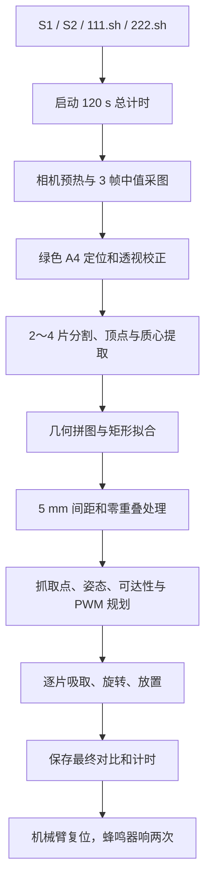
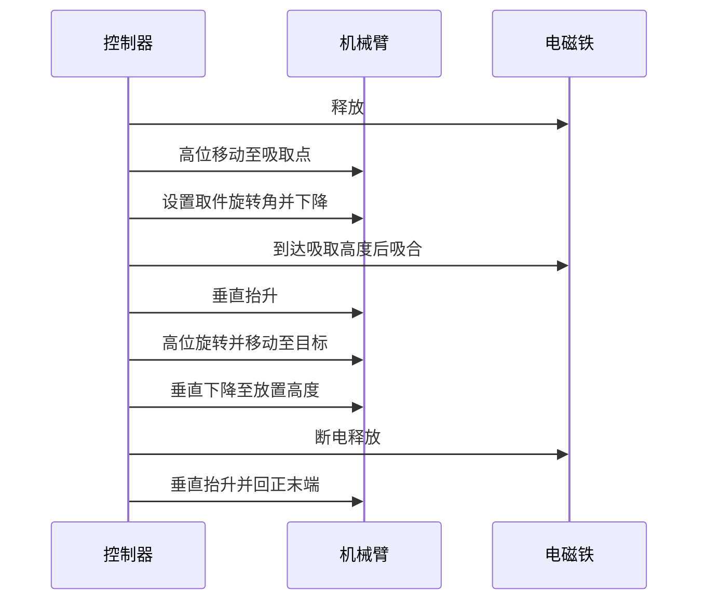

# E 题拼图装置：最终视觉—电控技术方案

版本：2026-08-01 实机闭环版
平台：NVIDIA Orin NX 16 GB、ROS 2 Humble、KM1 PWM 机械臂、可旋转电磁铁

## 1. 总体方案

系统采用“单次采图、单次解算、连续执行”的闭环结构。按下 S1 或 S2 后，Orin 自动启动相机、识别 A4 和碎片、规划矩形、计算机械臂轨迹、依次搬运全部可行动碎片、复位并响两次。比赛流程不等待人工确认，也不进行第二次视觉解算。



## 2. 固定硬件条件

| 项目 | 最终实测配置 |
|---|---|
| A4 | 绿色 A4，纸面距地面 30 mm |
| 纸张基准 | 近侧长边中点与机械臂底座前沿中点对齐 |
| 相机投影 | 落在 A4 近侧长边中点，X/Y 偏移均为 0 |
| 镜头高度 | 距地面 460 mm，距纸面 430 mm |
| 相机输入 | USB RGB，MJPG 1920×1080@30 |
| 深度信息 | 不需要；碎片均位于已知平面 |
| 电磁铁 | 半径 20 mm、高 20 mm，替换原夹爪并可绕末端轴旋转 |
| 机械臂底板 | 距地面 10 mm |
| 串口 | `/dev/ttyCH341USB0`，115200 baud |

物理台架是右半区取料、左半区拼装。由于相机和透视校正方向，诊断图片中通常表现为上半区取料、下半区拼装；控制坐标仍以代码中的纸面毫米坐标为准，不应根据截图方向手工交换 X/Y。

普通 RGB 相机已足够完成任务。只有碎片可能叠放、翘曲或纸面 Z 未知时，深度相机才会提供额外价值。

## 3. 视觉处理

### 3.1 A4 与碎片检测

相机采集 3 帧并取中值，降低瞬时噪声和灯光闪烁。绿色 A4 使用两级 HSV 范围定位：较宽范围负责纸面检测，校正后的范围负责背景建模。检测到纸面四边形后，系统生成统一的 210×297 mm 纸面坐标。

碎片分割组合使用 Lab 背景距离、HSV 非绿色区域和形态学处理，不依赖固定扑克牌模板。轮廓经过毫米尺度简化后拟合为多边形，并输出顶点、质心、姿态和面积。

| 约束 | 当前设置 |
|---|---:|
| 碎片数量 | 2～4 |
| 单片最大顶点数 | 5 |
| 单片最小面积 | 120 mm² |
| 总碎片面积 | 2200～13000 mm² |
| Task1 伪短边裁剪 | 5 mm |
| Task2 伪短边裁剪 | 10 mm |

Task2 的 10 mm 只用于抑制低分辨率下产生的伪边，不代替题目真实边长判定。Task1 保留 5 mm 下限，避免真实短边被过度删除。

### 3.2 拼图求解

求解器枚举碎片边之间的全边或分段边匹配，只允许对碎片执行刚性旋转和平移，不进行缩放和形变。候选首先按矩形拟合、外边完整性、填充误差和几何接缝评分；现场牌面可以变化，因此不使用 52 张固定牌面模板作为识别前提。

Task1 使用自备目标尺寸约束；Task2 使用现场矩形长边 90～120 mm、短边 50～90 mm 的规则范围。尺寸约束作用于增加间距之前的名义矩形，加间距后的总体外接范围可以更大。

若严格矩形候选存在，优先使用严格候选。若局部几何接近阈值，搜索阶段允许少量重叠容差以避免过早拒绝，最终结果再统一消除重叠。核心原则是优先得到可执行方案，不能因为单个碎片不可达而取消其他碎片动作。

### 3.3 放置间距

名义拼图完成后，各碎片沿拼图中心方向刚性外移。算法以匹配端点的最小距离达到 5 mm 为目标，同时检查所有片间轮廓。

| 指标 | 最终门限 |
|---|---:|
| Task1/Task2 目标顶点间距 | 5 mm |
| 数值容差 | ±0.25 mm |
| 软件顶点间距上限 | 18 mm |
| 题目顶点间距上限 | 20 mm |
| 最终计算重叠面积 | 0 mm² |

5 mm 是防止机械控制误差导致重叠的规划余量，不是必须强制所有边保持相同缝隙的硬约束。18 mm 上限给实体落点误差保留约 2 mm 余量。

## 4. 坐标与手眼关系

校正后的纸面坐标定义为：

| 轴 | 方向 |
|---|---|
| `paper_x` | 物理远边 0 → 近机械臂边 210 mm |
| `paper_y` | 物理右边 0 → 左边 297 mm |

当前固定外参位于 `control_geometry.py`：

```python
robot_x = 148.5 - paper_y
robot_y = 265.0 - paper_x
```

纸面中心 `(105, 148.5)` 映射到机械臂平面坐标 `(0, 160)` mm。相机相对纸张长边中点的 X/Y 偏移均为 0。腕轴到电磁铁吸附面的有效工具长度使用 50 mm；原夹爪的 155 mm 参数和早期 80 mm 估计均已废弃。

如果移动相机、A4、底座、垫高板或电磁铁，以上外参和 Z 高度必须重新标定。

## 5. 可达性规划

控制层先使用视觉给出的原始矩形方向，仅搜索整体平移。只要完整布局位于目标半区且 4 片均可达，就保持视觉方向不旋转。

只有原布局存在不可达目标时，才按较小角度优先搜索旋转候选。旋转后的完整布局仍必须位于目标半区，保持碎片间距且不能重叠。若所有整体旋转仍无法覆盖某片，则为该片寻找目标半区内最近的安全可达点，并在 JSON 和规划图中标记 `approximate_target=true` 与偏移距离。

规划顺序为：

1. 最大化可执行碎片数量。
2. 在数量相同的情况下优先原始布局方向。
3. 在布局相同的情况下尽量使用更高的搬运高度。
4. 抓取优先保持电磁铁垂直向下，即 `-90°`；仅在远端不可达时使用附近允许角度。
5. 即使某片只能近似放置，其他可执行碎片仍继续搬运。

## 6. 机械臂动作时序

当前纸面控制基准 Z 为 25 mm。规划高度使用相对纸面的间隙：吸取 20 mm、放置 25 mm、搬运高度在 70～150 mm 间按可达性选择。对应常见绝对值为吸取 Z=45 mm、放置 Z=50 mm；搬运 Z 会随碎片位置动态降低，不是写死轨迹。

单片动作如下：



高位搬运和下降阶段保持电磁铁关闭，避免远距离吸附把碎片横向拉离视觉质心。末端旋转只在离开纸面后进行，放置阶段保持垂直，减少电磁铁侧面碰撞纸面造成的推移。

## 7. PWM 与电磁铁

| ID | 功能 | 当前范围/值 |
|---:|---|---|
| 0～3 | 底座、大臂、小臂、腕部 | 由逆运动学和 PWM 安全余量计算 |
| 4 | 电磁铁整体旋转 | 中值 1500 μs，限制 550～2450 μs |
| 5 | 电磁铁状态信号 | 1100 μs 吸合，1500 μs 释放 |

外部板按小于约 1.2 ms 吸合、大于约 1.4 ms 释放。ID5 只提供控制信号，线圈必须由独立功率级驱动并做好续流、共地和失效释放。

所有 PWM 指令只能经过 ROS `serial_driver` 发往 Arduino。任何一次性打开 CH341 串口的程序都会触发 DTR 复位，可能造成机械臂突然复位或电磁铁状态异常。

## 8. GPIO 与运行入口

S1 使用物理引脚 7，S2 使用物理引脚 15，GND 为 6，VCC 为 1。按键服务映射如下：

| 入口 | 执行内容 |
|---|---|
| S1 / `~/111.sh` | Task1 完整闭环 |
| S2 / `~/222.sh` | Task2 完整闭环 |

脚本使用互斥锁，防止两轮任务同时运行。启动 STM32/Arduino 后不需要单独执行键盘节点；每轮 launch 会统一启动串口驱动、控制器和视觉桥接。

## 9. 诊断与计时

每轮从 launch 创建前开始计时，限制为 120 s。过程会自动保存原图、校正图、边缘/分割、检测、拼图、可执行轨迹、每片吸附与放置画面、最终实拍对比和计时 JSON。

近似可达、跳过原因、布局旋转、整体平移、抓取角度、PWM 和每个阶段时间均写入日志。流程结束后机械臂先回安全位，再让蜂鸣器响两次。

## 10. 最终实机结果

| 任务 | 结果 | 总耗时 | 布局旋转 | 近似兜底 |
|---|---:|---:|---:|---:|
| Task1 | 4/4 | 79.959 s | 0° | 0 片 |
| Task2 | 4/4 | 83.873 s | 0° | 0 片 |

两次均在 120 s 内完成，动作结束后机械臂复位并响两次。最终相机结果仍可能存在毫米级落点、旋转和吸附滑移误差，因此规划阶段只使用 5 mm 间距并保留题目上限余量。

## 11. 比赛前检查

| 检查项 | 合格状态 |
|---|---|
| A4、相机和机械臂 | 与固定基准一致，没有移动 |
| 相机 | `/dev/video0` 可打开，画面完整覆盖 A4 |
| 串口 | `/dev/ttyCH341USB0` 存在且无其他进程占用 |
| 电磁铁 | 杜邦线牢固，手动吸放声音正常 |
| 按键服务 | `systemctl status km1-competition-buttons` 为 active |
| 脚本 | `~/111.sh`、`~/222.sh` 可执行 |
| 纸面 | 无重叠碎片，目标半区无遮挡 |

出现异常时先断开自动动作并保存本轮 `button_runs`，不要在未确认串口持有者和机械臂姿态的情况下重复启动。
